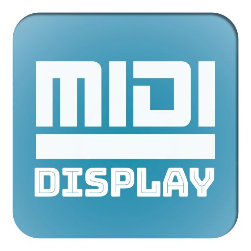

# midiDisplay

Attach your usb-midi devices and make them available over network.
Small GUI for displays which shows devices, ports and activity.
midi ports will be reconfigured automatically when new devices are plugged in.



## DEPENDENCIES
+ Python >= 2.7.x
+ Bash / Subsystem
+ Display Python Libs (included: lib_oled96.py)

## INSTALLATION
Get the source by cloning the repository from git:
```
git clone git@github.com:gemichelst/midiDisplay.git && cd midiDisplay
```

midiDisplay will be installed at '/usr/local/etc/midiDisplay' .
Run the installer and let the magic happen.

```
bin/midiDisplay-install 
```

## CONFIGURATION
YES, this tool really needs some configuration. 
For this you only need to know how to use your fingers to write letters
which are combined to words => which are combined to phrases => which are ... 
You will find the following .conf files in the similar named folder: 
+ midiDisplay.conf
+ raveloxmidi.conf

To change the main config for midiDisplay you need to edit 'midiDisplay.conf'. There you will find general stuff like mysql, tokens etc.

midiDisplay.conf
```
MD_BASE_DIR="/usr/local/etc/midiDisplay"

# GENERATE SOME ENV VARS
MD_BIN_DIR="$MD_BASE_DIR/bin"
MD_CONF_DIR="$MD_BASE_DIR/conf"
MD_SRC_DIR="$MD_BASE_DIR/src"
MD_TMP_DIR="$MD_BASE_DIR/tmp"
MD_ASSETS_DIR="$MD_BASE_DIR/assets"
MD_LOG_FILE_NAME="midiDisplay.log"
MD_LOG_FILE="$MD_TMP_DIR/MD_LOG_FILE_NAME"
MD_DUMP_FILE="$MD_TMP_DIR/midiDisplay.dump"
MD_PORTIDS_FILE="$MD_TMP_DIR/midiDisplay.portids"
MD_PACKETS_FILE="$MD_TMP_DIR/midiDisplay.packets"
```

To change the config for raveloxmidi[link] you need to edit 'raveloxmidi.conf.conf'. This is needed for AppleRTPMidi. 

raveloxmidi.conf
```
#alsa.input_device.0 = hw:2,0,0
#alsa.input_device.1 = hw:3,0,0
#alsa.input_device.2 = hw:4,0,0
alsa.input_device = hw:0,0
alsa.output_device = hw:0,0
network.bind_address = 0.0.0.0
network.control.port = 5004
network.data.port = 5005
network.local.port = 5006
service.ipv4 = yes
service.ipv6 = no
#network.max_connections = 8
service.name = raveloxmidi
#remote.connect = 192.168.11.52:5004
remote.use_control = yes
client.name = raveloxmidi
run_as_daemon = yes
daemon.pid_file = /var/run/raveloxmidi.pid
logging.log_file = /usr/local/etc/midiDisplay/tmp/midiDisplay-raveloxmidi.log
logging.enabled = yes
logging.log_level = info
#inbound_midi = /dev/sequencer
#file_mode = 0640
```

## USAGE
To grab new posts you need to use the following command while you are in the $DOCROOT:

```
bin/midiDisplay
```

The [ProjectID] is the internalt pid which will be autogenerated when inserting this project the first time to the database.
The [ProjectTitle] is the title of this pid.

full example:

```
php -f /src/php/feedbot.php lufthansa 68
```

## WEB-GUI
The WEB-GUI will autostart but for any case you can also (re)start it manually.
Use the following command:
```
bin/midiDisplay-server
```

All the needed styles, scripts and html files for the customer view are located there and are highly customized for the specified customer.
Every new project/customer need its own dir and own customisation.
Please have a look at the example customer dir. There you will find an explanation what you need to customize and how you need to customize the files.

General libs like jQuery or the bxslider are 
located in the root of the $DOCROOT and should not be uploaded twice:
```
$DOCROOT/lib/*
```


## Authors

* **Michael Matzat** - *BackendDevelopment/Animations/Frontend/Webdesign*
* **Pablo Rueda Molto** - *Frontend/WebDesign*

